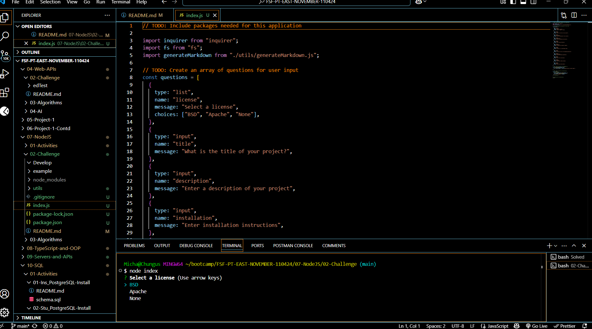

# Professional README Generator

  

  ## Description
A command-line application that dynamically generates a professional README.md file from a user's input using the Inquirer package. This tool simplifies the process of creating a well-structured and complete README, saving time and ensuring consistency across projects.

  ## Table of Contents
  - [Installation](#Installation)
  - [Usage](#Usage)
  - [Screenshot](#Screenshot)
  - [Walkthrough Video](#Walkthrough-Video)
  - [Deployment](#Deployment)
  - [Contribution](#Contribution)
  - [Tests](#Tests)
  - [License](#License)
  - [Questions](#Questions)

  ## Installation
  To install this project, clone the repository and run the following command in the terminal to install dependencies:
  npm install

  ## Usage
  Invoke the application from the command line using:
  node index.js

  ## Screenshot

  ## Walkthrough Video
  https://drive.google.com/file/d/1rP-BtrPQbG8g3wrtJIQrqi6grj9fs67x/view

  ## Deployment
  This application is intended to be used locally and is not deployed on the web. You can clone or fork the repository to use it on your machine.

  ## Contribution
  Contributions are welcome! If you have suggestions or improvements, feel free to fork the repo and submit a pull request.

  ## Tests
  You can test the application by running node index.js and verifying that the outputted README.md file correctly reflects your input.

  ## License

This project is licensed under the BSD license.
 

  ## Questions
  If you have any questions, please contact me at michael.mangieri@yahoo.com.

  You can find more of my work at [github.com/hazyplebian]

